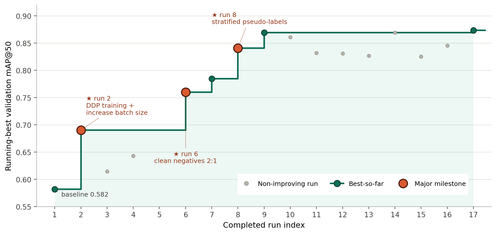

# [arXiv'26] De la intención clínica al modelo clínico: Un marco de agente de codificación autónomo para el desarrollo de IA impulsado por clínicos 🤖
---
Clinical Automata permite a un clínico describir un problema en lenguaje natural — *"ayúdame a diagnosticar un neumotórax, pero no permitas que el modelo haga trampa mirando los tubos de drenaje torácico"* — y devuelve un modelo de aprendizaje profundo entrenado y específico para la tarea. No se requiere un intermediario en ciencia de datos. 

<p align="left">por Zihao Zhao, Frederik Hauke, Juliana De Castilhos, Jakob Nikolas Kather, Sven Nebelung y Daniel Truhn</p>


<!-- 📄 **Paper:** *From Clinical Intent to Clinical Model: An Autonomous Coding-Agent Framework for Clinician-driven AI Development* (Zhao et al., 2026) -->

<div align="center">
  
</div>

> <p align="justify">
> <strong>Comparación entre el flujo de trabajo convencional multiparte y nuestro flujo de trabajo impulsado por clínicos.</strong> En el paradigma convencional, los clínicos dependen de discusiones con expertos en IA para traducir las necesidades clínicas en una implementación técnica, lo que puede generar costos de coordinación e introducir desalineaciones debido a que cada parte carece de un conocimiento profundo del dominio de la otra. Nuestro marco propuesto reemplaza este cuello de botella humano intermedio con un agente de codificación autónomo. Aunque no es un especialista en ningún dominio único, el agente posee un conocimiento lo suficientemente amplio para conectar la medicina y la IA, mientras que su sólida capacidad de codificación autónoma hace posible el desarrollo directo de IA impulsado por clínicos.
</p>

---

## Desarrollo autónomo
 
El agente propone una pipeline y luego la mejora iterativamente mediante entrenamiento/validación. A continuación se muestra una trayectoria real de refinamiento en la tarea de fractura de muñeca con supervisión mixta, donde solo el 5% de las imágenes de entrenamiento tenían cajas delimitadoras (bounding boxes). Partiendo de una línea base de 0.582 mAP@50, el agente ascendió a **0.87** al descubrir de forma autónoma tres movimientos clave: entrenamiento distribuido con un tamaño de lote mayor (run 2), negativos curados (run 6) y una estrategia de pseudoetiquetado maestro-estudiante que aprovechó el pool del 95% solo a nivel de imagen (run 8).
 
<!--  -->
<div align="center">
  
</div>

Cabe destacar que la mayor parte de la mejora proviene de un puñado de ediciones exitosas de los 30 intentos. Las demás ediciones, marcadas por un círculo gris, son descartadas por la regla de aceptación.

---

## Cómo funciona

Una solicitud de un clínico fluye a través de tres etapas:

1. **Semantic Parser** — convierte la solicitud en lenguaje natural en una representación estructurada que captura el *objetivo clínico*, la *preferencia de riesgo* y el *formato de salida*.
2. **Task Initializer** — traduce esa representación en una base de código ejecutable: arquitectura del modelo, receta de entrenamiento y protocolo de evaluación.
3. **Autonomous Developer** — edita iterativamente la base de código, ejecuta experimentos, inspecciona fallos y conserva cualquier cambio que mejore un objetivo de validación preespecificado. El clínico puede inspeccionar las decisiones y negociar compromisos a lo largo del proceso.

En el interior, los tres roles son desempeñados por un agente de codificación (Claude Opus 4.6 en nuestros experimentos). Cada iteración ejecuta un ciclo de entrenamiento/validación dentro de un presupuesto de tiempo fijo. El conjunto de prueba se mantiene oculto desde el principio y se toca exactamente una vez, al final.

---

## Estructura del proyecto

```
  clinical-automata/
  ├── README.md           # This file                                                                       
  ├── asset/              # Figures used in README      
  └── src/                                                                                                  		
      ├── Parser.md       # Semantic parser prompt: clinician request → structured task spec                
      ├── program.md      # Task Initializer & Autonomous Developer prompts                                 
      ├── README.md       # In-repo context provided to the coding agent                                    
      ├── prepare.py      # Constants and setup helpers                                                     
      ├── gpu.sh          # GPU request script (SLURM)                                                      
      ├── pyproject.toml  # Project metadata and Python dependencies                                		
      └── uv.lock         # Locked dependency versions (uv)   		
```

---

## Inicio rápido


```bash

# 1. Install uv project manager (if you don't already have it)
curl -LsSf https://astral.sh/uv/install.sh | sh

# 2. Install dependencies
uv sync

# 3. Download and activate Claude CLI
curl -fsSL https://claude.ai/install.sh | bash

claude --permission-mode bypassPermissions

# 4. Prompt something like
[$your_request$] Please review program.md and start a new experiment. Let us begin with the setup first.
```


---

## Requisitos

- Python ≥ 3.10
- PyTorch ≥ 2.1, GPU compatible con CUDA
- Acceso a un agente de codificación capaz (CLI de Claude Opus 4.6 utilizadautilizado en el artículo)
- Durante los experimentos, el agente de codificación instala paquetes específicos del conjunto de datos y de la tarea bajo demanda, por lo que `src/uv.lock` refleja el estado acumulado de ejecuciones pasadas en lugar de una línea base limpia. Para un entorno de funcionamiento mínimo, consulta el archivo de bloqueo en [karpathy/autoresearch](https://github.com/karpathy/autoresearch/blob/master/uv.lock).
---

## Citación

Si utilizas este trabajo, por favor cita:

```bibtex
@article{zhao2026clinicalautomata,
  title   = {From Clinical Intent to Clinical Model: An Autonomous Coding-Agent
             Framework for Clinician-driven AI Development},
  author  = {Zhao, Zihao and Hauke, Frederik and De Castilhos, Juliana
             and Kather, Jakob Nikolas and Nebelung, Sven and Truhn, Daniel},
  year    = {2026}
}
```

---

## Datos

Todos los conjuntos de datos utilizados están disponibles públicamente:

- [ISIC 2019](https://challenge.isic-archive.com/data/) — clasificación de lesiones dermatoscópicas
- [GRAZPEDWRI-DX](https://figshare.com/articles/dataset/GRAZPEDWRI-DX/14825193) — radiografías de muñeca pediátricas
- [SIIM-ACR Pneumothorax](https://www.kaggle.com/datasets/anisayari/siimacrpneumothoraxsegmentationzip-dataset) — radiografías de tórax
- [NEATX](https://zenodo.org/records/14944064) — anotaciones de drenaje torácico sobre un subconjunto de NIH ChestX-ray14

---

## Agradecimientos

Agradecemos a Andrej Karpathy por abrir el código de [autoresearch](https://github.com/karpathy/autoresearch), que inspiró este estudio.
