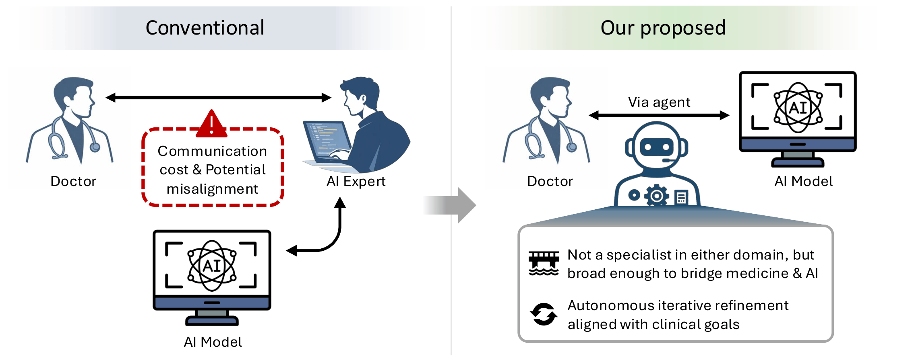

# Clinical Automata 🤖


Clinical Automata lets a clinician describe a problem in plain language — *"help me diagnose pneumothorax, but don't let the model cheat by looking at chest drains"* — and returns a trained, task-specific deep-learning model. No data-science middleman required.

📄 **Paper:** *From Clinical Intent to Clinical Model: An Autonomous Coding-Agent Framework for Clinician-driven AI Development* (Zhao et al., 2026)

<div align="center">
  
</div>

> <p align="justify">
> <strong>Comparison between conventional multi-party workflow and our proposed clinician-driven workflow.</strong> In the conventional paradigm, clinicians rely on discussions with AI experts to translate clinical needs into technical implementation, which may incur coordination costs and introduce misalignment because each side lacks deep knowledge of the other's domain. Our proposed framework replaces this intermediate human bottleneck with an autonomous coding agent. Although not a specialist in any single domain, the agent has sufficiently broad knowledge to bridge medicine and AI, while its strong autonomous coding capability makes direct clinician-driven AI development possible.
</p>

---

## Why this exists

Clinical AI has traditionally needed a long chain: clinician → AI expert → data pipeline → model → back to clinician. Each handoff takes time, and clinical priorities (*"do not miss a single melanoma"*, *"don't rely on chest drains"*) often get lost in translation.

Clinical Automata replaces the intermediate human bottleneck with an autonomous coding agent that is **not a specialist in either medicine or ML, but broad enough to bridge the two**. The clinician stays in control of *intent*; the agent handles *implementation*.

```
Before:   Doctor  ⇄  AI Expert  ⇄  AI Model
After:    Doctor  ⇄  Clinical Automata  ⇄  AI Model
```

---

## How it works

A clinician request flows through three stages:

1. **Semantic Parser** — converts the natural-language request into a structured representation capturing the *clinical objective*, *risk preference*, and *output format*.
2. **Task Initializer** — translates that representation into an executable codebase: model architecture, training recipe, evaluation protocol.
3. **Autonomous Developer** — iteratively edits the codebase, runs experiments, inspects failures, and keeps whatever improves a prespecified validation objective. The clinician can inspect choices and negotiate trade-offs along the way.

Under the hood, the three roles are played by a coding agent (Claude Opus 4.6 in our experiments). Each iteration runs a train/validation cycle inside a fixed time budget. The test set is held out from the start and touched exactly once, at the end.

---


## Example requests

The system is initiated with clinician-style natural language — no ML jargon required.

```text
"I want an AI model to help diagnose skin lesions. Priority should be given to melanoma."

"I want to distinguish melanoma from nevus. Please try your best not to miss a single case."

"I need a tool that looks at wrist X-rays and marks suspicious fractures during my workflow."

"I want to diagnose pneumothorax on chest X-rays. My concern is that chest drains may act
 as a strong confounder — please take this issue seriously."
```

Each one produced a runnable pipeline and a meaningfully refined model. The agent interpreted asymmetric error preferences ("don't miss melanomas" → sensitivity emphasis, focal loss), inferred supervision structure, and implemented deconfounding methods without being told which technique to use.

---

## Repository layout

```
src/
├── Parser.md              # Semantic parser, task initializer, autonomous developer
├── program.md               # Task templates (classification, detection, debiasing, ...)
├── README.md            # Dataset adapters (ISIC, GRAZPEDWRI-DX, SIIM-ACR, NEATX)
├── gpu.sh             # Iterative train/val loop, result logging, acceptance rule
├── uv.lock                # Held-out test evaluation + bootstrap CIs
├── pyproject.toml            # End-to-end reproductions of the five paper tasks
└── prepare.py             # Compute, iteration budget, model-selection criteria
```

---

## Quick start

```bash
```


---

## Requirements

- Python ≥ 3.10
- PyTorch ≥ 2.1, CUDA-capable GPU
- Access to a capable coding agent (Claude Opus 4.6 CLI used in the paper)
- The code agent will automatically install dataset or task specific packages during experiments, and src/uv.lock has actually been modified through experiments. Please refer to https://github.com/karpathy/autoresearch/blob/master/uv.lock for a minimum runable environment construction.
---

## Citation

If you use this work, please cite:

```bibtex
@article{zhao2026clinicalautomata,
  title   = {From Clinical Intent to Clinical Model: An Autonomous Coding-Agent
             Framework for Clinician-driven AI Development},
  author  = {Zhao, Zihao and Hauke, Frederik and De Castilhos, Juliana
             and Kather, Jakob Nikolas and Nebelung, Sven and Truhn, Daniel},
  year    = {2026}
}
```

---

## Data

All datasets used are publicly available:

- [ISIC 2019](https://challenge.isic-archive.com/data/) — dermoscopic lesion classification
- [GRAZPEDWRI-DX](https://figshare.com/articles/dataset/GRAZPEDWRI-DX/14825193) — pediatric wrist radiographs
- [SIIM-ACR Pneumothorax](https://www.kaggle.com/datasets/anisayari/siimacrpneumothoraxsegmentationzip-dataset) — chest radiographs
- [NEATX](https://zenodo.org/records/14944064) — chest-drain annotations over a subset of NIH ChestX-ray14

---

## Acknowledgements

We thanks Andrej Karpathy for open-sourcing [autoresearch](https://github.com/karpathy/autoresearch), which inspires this study.

